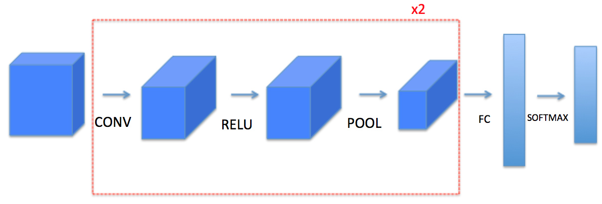

# Convolution Model from Scratch

This repository is the implementation of convolutional(CONV) and pooling (POOL) layers in numpy, including both forward and backward propagation.

## Convolutional Neural Networks

A convolution layer transforms an input volume into an output volume of different size, as shown below. 

<center></center>

## Building block of the convolutional neural network

- Convolution functions, including:
    * Zero Padding
    * Convolve window 
    * Convolution forward
    * Convolution backward
- Pooling functions, including:
    * Pooling forward
    * Create mask 
    * Distribute value
    * Pooling backward

## Architecture
The Arcitecture of the model.

<center></center>

## Zero Padding
Zero-padding adds zeros around the border of an image:
<center></center>

## Single Step Convolution
A single step of convolution will apply the filter to a single position of the input. This will be used to build a convolutional unit, which: 

- Takes an input volume 
- Applies a filter at every position of the input
- Outputs another volume (usually of different size)
<center></center>

### Convolutional Neural Networks - Forward Pass
In the forward pass, we will take many filters and convolve them on the input. Each 'convolution' gives us a 2D matrix output. We will then stack these outputs to get a 3D volume:


https://github.com/abel-shimeles/CNN_From_Scratch/assets/127602569/b2842799-e74c-4ffa-85f8-618d8f8f5e61


## Pooling Layer
The pooling (POOL) layer reduces the height and width of the input. It helps reduce computation, as well as helps make feature detectors more invariant to its position in the input. The two types of pooling layers are: 

- Max-pooling layer: slides an ($f, f$) window over the input and stores the max value of the window in the output.

- Average-pooling layer: slides an ($f, f$) window over the input and stores the average value of the window in the output.

<table>
<td>

<td>

<td>

<td>
</table>


## Setup
1. Clone this repository

```shell
git clone https://github.com/abel-shimeles/CNN_From_Scratch
cd CNN_From_Scratch
```

2. Using the [cnn.py](cnn.py) file build your own CNN Model by using your own data.


